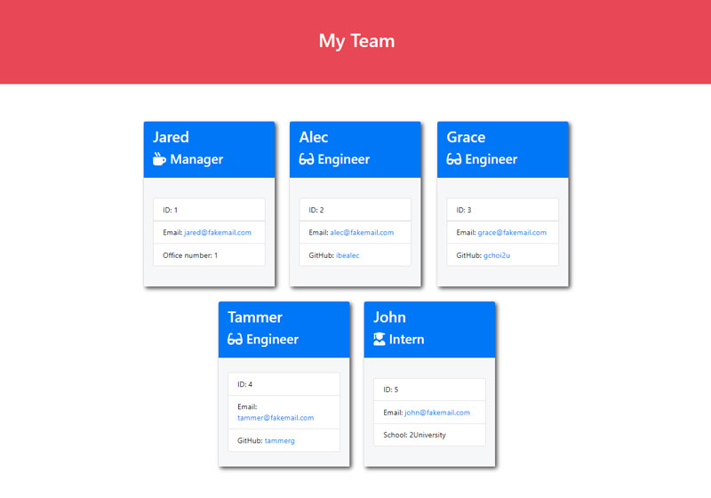

# Team Profile Generator

## Description 

An Amazing Node.js command-line application that takes information about employees team for a Department and generates an HTML webpage that displays business information for each person.

Application developed using ES6 Syntax and Node.js. 

## Table of Contents

* [URLs](#urls)
* [Installation](#installation)
* [Usage](#usage)
* [Contributing](#Contributing)
* [License](#license)
* [Test](#Test)
* [Questions](#questions)
* [Screenshots](#screenshots)

## URLs

* GitHub Repository:
    - [HTTPS: https://github.com/rogers0404/10-team-profile-generator.git](https://github.com/rogers0404/10-team-profile-generator.git)    
    - [GIT: git@github.com:rogers0404/10-team-profile-generator.git](git@github.com:rogers0404/10-team-profile-generator.git)

* Link Video
    - [Video: https://drive.google.com/file/d/1HqMTZ4fwL7h1bLdVHcnpat2V8hMp9yva/view](https://drive.google.com/file/d/1HqMTZ4fwL7h1bLdVHcnpat2V8hMp9yva/view)

## Installation

You need some packages to run this application, 

- `git clone url-repository        //clone the repository given above`
- `npm i                           // or npm install to get all packages and dependencies of NPM`
- `npm init                        // to get package.json`
- `npm install inquirer            // check wether you have installed npm packages or just instal inquirer`
- `npm install jest --save-dev     // install jest for test your code`

## Usage 

The starting command-line is:

`node index.js `                  // to run the application

You need to follow to instructions. see Section [Screenshots](#screenshots)

## Contributing

* Rogers Ramirez, Github User: [rogers0404](http://github.com/rogers0404)

## License

Team Profile Generator is licensed under the

None

## Test

``npm run test`` //# press enter. Jest Test for all Classes

## Questions

If you have any questions about the application, you can check the documentation on my GitHub profile [https://github.com/rogers0404](https://github.com/rogers0404).

for more information you can have a question via email [rogers.ramirez2008@gmail.com](rogers.ramirez2008@gmail.com)  .

## Screenshots

### Inicial Mock-up 

### Screenshot 1

### Screenshot 2

